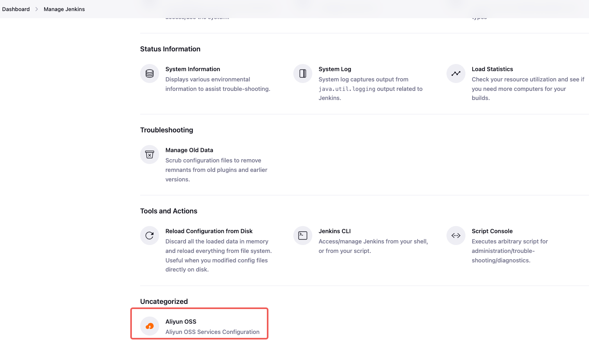
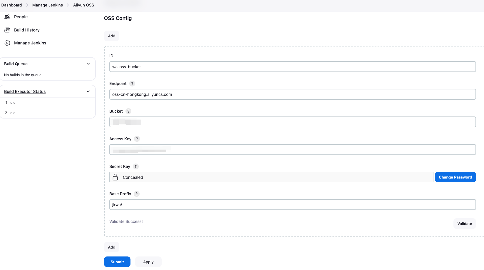
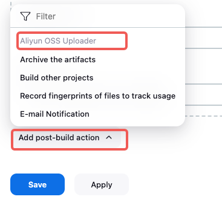
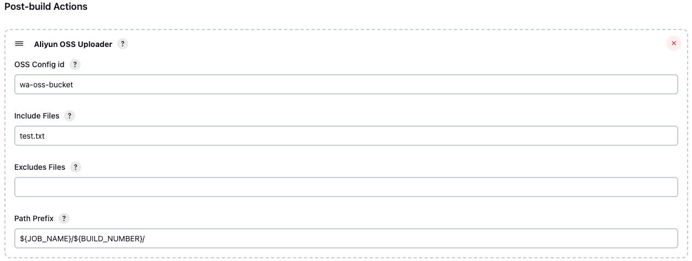
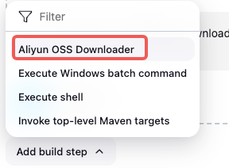
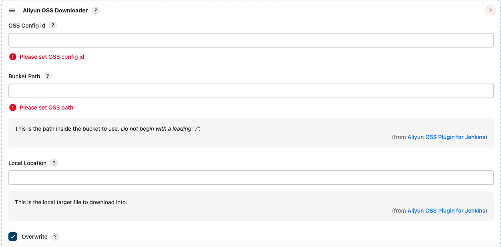

# Jenkins Aliyun OSS Plugin

## 介绍

使用阿里云对象存储服务来建立交付仓库。

## 特性

- ossUpload：将构建过程中的文件上传到OSS的指定位置。
- ossDownload：从OSS的指定位置下载文件。

## 使用

### 全局配置

| 参数       | 参数名称    | 参数解释                                                     |
| ---------- | ----------- | ------------------------------------------------------------ |
| id         | ID          | 配置ID，不指定uuid随机生成                                   |
| endpoint   | Endpoint    | OSS访问端点 [OSS访问域名和数据中心_对象存储(OSS)-阿里云帮助中心 (aliyun.com)](https://help.aliyun.com/zh/oss/user-guide/regions-and-endpoints?spm=a2c4g.11186623.4.2.673924afzC8wfI&scm=20140722.H_31837._.ID_31837-OR_rec-V_1) |
| bucket     | Bucket      | OSS存储桶                                                    |
| accessKey  | Access Key  | 存储桶访问凭证-AK                                            |
| secretKey  | Secret Key  | 存储桶访问凭证-SK                                            |
| basePrefix | Base Prefix | 文件存储基准位置，开头不能有'/'，结尾必须有'/'。             |

在Jenkins系统管理 -> Aliyun OSS，配置OSS存储桶和访问凭证信息。





### ossUpload

| 参数       | 参数名称       | 参数解释                                                 |
| ---------- | -------------- | -------------------------------------------------------- |
| ossId      | OSS Config id  | 全局配置中的ID                                           |
| includes   | Include Files  | 包含文件，`dist/**`   `target/**.jar`                    |
| excludes   | Excludes Files | 排除文件，`*.svg,*.png`                                  |
| pathPrefix | Path Prefix    | 文件上传到存储桶的路径前缀，开头不能有'/'，结尾必须有'/' |

假如作业名称为 `foo/bar`，配置如下：

- OSS全局配置 Base Prefix：jkwa/
- Path Prefix：${JOB_NAME}/${BUILD_NUMBER}/
- Upload Files：hello.txt,hello1.txt

上传之后文件 hello.txt 在 OSS存储桶的路径为：jkwa/foo/bar/5/hello.txt

#### Freestyle 作业

在 Add post-build action（增加构建后操作步骤）选择 Aliyun OSS Uploader。



配置参数。



#### Pipeline 作业

```groovy
pipeline {
    agent any
    
    environment {
        aliyunOssId='wa-oss-bucket'
    }
    
    stages {
        stage('Upload') {
            steps {
                sh 'mkdir -p test'
              	sh 'echo "Hello jenkins" > test/hello.txt'
                sh 'ls -hl'
                ossUpload ossId: aliyunOssId, pathPrefix: '${JOB_NAME}/${BUILD_NUMBER}/', includes: 'test/*.txt', excludes: 'test/*.png'
            }
        }
    }
}
```

### ossDownload

| 参数     | 参数名称       | 参数解释                                  |
| -------- | -------------- | ----------------------------------------- |
| ossId    | OSS Config id  | 全局配置中的ID                            |
| path     | Bucket Path    | OSS路径，不能以'/'开头                    |
| location | Local Location | 本地的下载位置，不填默认在workspace根目录 |
| force    | Ovewrite       | 是否强制覆盖之前的文件，默认为true        |

#### Freestyle 作业

在 Add build step（增加构建步骤）选择 Aliyun OSS Downloader。



填写配置。



#### Pipeline 作业

```groovy
pipeline {
    agent any
    
    environment {
        CI_JOB_NAME = 'foo/bar'
        CI_BUILD_NUMBER = '5'
        aliyunOssId='wa-oss-bucket'
    }
    
    stages {
        stage('Download') {
            steps {
                ossDownload ossId: aliyunOssId, location: '${CI_JOB_NAME}/${CI_BUILD_NUMBER}/', path: 'test/', force: true
                sh 'ls -hl test'
            }
        }
    }
}
```

